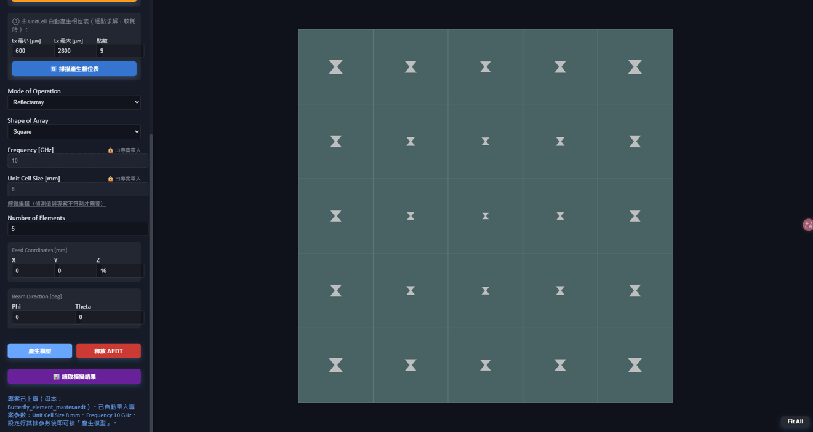
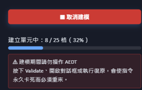
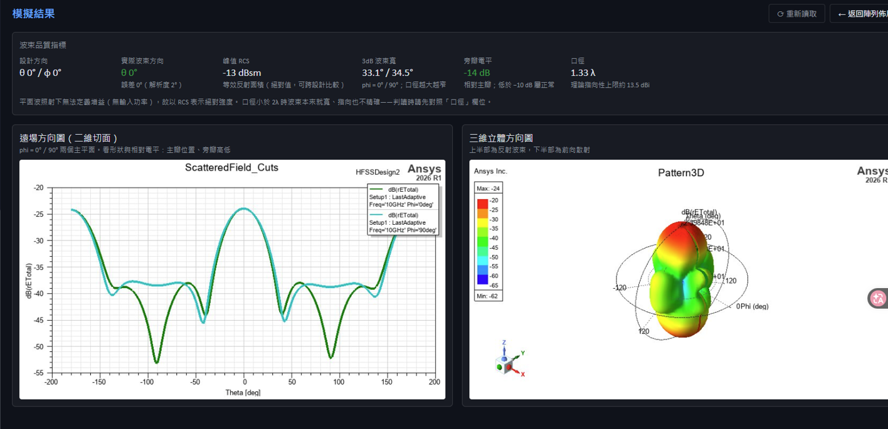
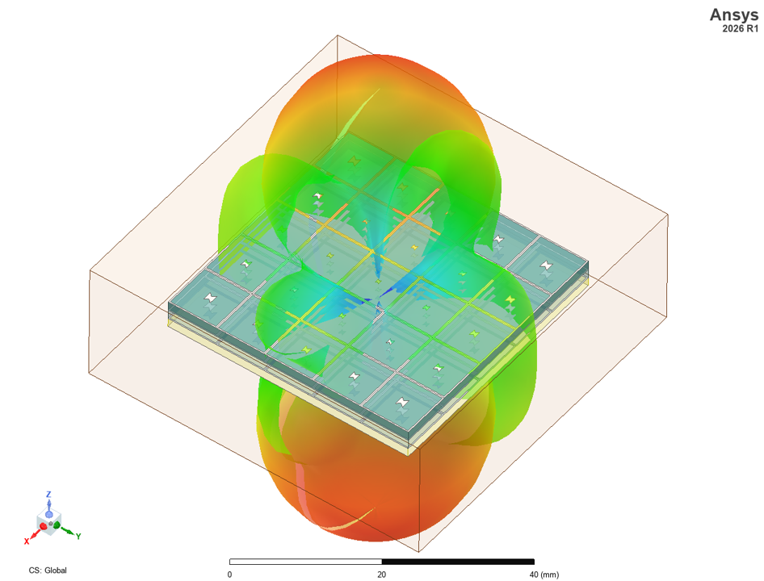
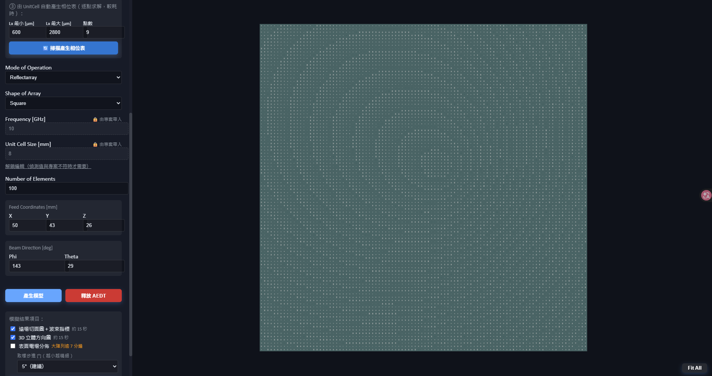
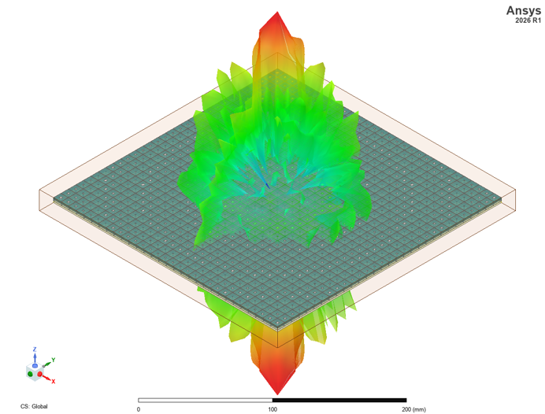

# Metasurface Toolkit Web 操作說明

> 此工具由虎門科技資深技術工程師 Jeff Hong 洪敬傑提供

本專案的設計流程改寫自 Ansys 官方 **MetaSurfaceToolkit**（`MetaSurfaceToolkit.pdf`，原作者：
Sharon Varghese、Nijas Kunju、Mahesh Babu，© 2020 ANSYS, Inc.），並擴充為可透過瀏覽器操作、
全自動連動 HFSS 的網頁工具。

> 📌 下方部分截圖攝於開發測試期間，畫面中可能仍顯示「Mode of Operation」欄位。
> 目前版本僅實作並驗證過 Reflectarray（反射陣列），該欄位已於後續版本移除；
> 其餘操作方式與截圖一致，不受影響。

## 目錄

1. [系統需求](#系統需求)
2. [下載與啟動](#下載與啟動)
3. [介面總覽](#介面總覽)
4. [操作流程：建立陣列](#操作流程建立陣列)
5. [操作流程：讀取模擬結果](#操作流程讀取模擬結果)
6. [大陣列實測（30×30、100×100）](#大陣列實測30times30100times100)
7. [相位資料表格式](#相位資料表格式)
8. [工具自動完成的事項](#工具自動完成的事項)
9. [產出檔案](#產出檔案)
10. [提示訊息與處理方式](#提示訊息與處理方式)
11. [疑難排解](#疑難排解)
12. [設計公式與已知限制](#設計公式與已知限制)

## 系統需求

| 項目 | 用途 | 安裝方式 |
|---|---|---|
| Windows 10/11（64 位元） | 執行環境 | — |
| Python 3.9–3.12（64 位元） | 後端 FastAPI 服務 | [python.org](https://www.python.org/downloads/)；找不到相容版本時 `start.ps1` 會嘗試以 WinGet 自動安裝，不影響你既有的 Python |
| Ansys AEDT（HFSS） | 建立陣列模型、相位掃描、讀取模擬結果 | 需自備商業授權；實測版本 2026 R1 |
| Node.js 18+（選用） | 僅開發模式（`dev.ps1`）需要，一般使用者不需要安裝 | [nodejs.org](https://nodejs.org/) |

## 下載與啟動

**GitHub 網頁下載**：點選 **Code → Download ZIP** 解壓縮，或直接下載 Release 附的 ZIP。

雙擊 **`start.bat`**。腳本會自動：偵測相容的 Python → 建立虛擬環境 → 安裝後端套件（首次需要網路連線，
之後可離線執行） → 檢查埠 8010 是否可用 → 啟動服務並自動開啟瀏覽器。

**全程只有一個視窗、一個網址（`http://127.0.0.1:8010`）**，關閉該視窗即結束程式。所有資料處理皆在本機
進行，不會上傳雲端。若埠被佔用，會顯示佔用的 PID 與程序名稱並停止，不會自動關閉不明程序。

## 介面總覽



左側面板由上而下：

| 區塊 | 說明 |
|---|---|
| ① 相位資料表 | 上傳 phase–Lx 對照表（`.csv`／`.xlsx`），上傳後 2D 預覽立即顯示 |
| ② UnitCell 專案檔 | 上傳 `.aedt`／`.aedtz`（**不需先在 AEDT 開啟**），自動偵測並鎖定 Unit Cell Size 與 Frequency |
| ③ 掃描產生相位表 | 沒有現成相位表時，由 UnitCell 專案自動掃描產生 |
| 陣列參數 | Shape、Number of Elements、Feed Coordinates、Beam Direction |
| 產生模型／釋放 AEDT | 觸發 HFSS 建模；結束後釋放 PyAEDT 連線 |
| 模擬結果項目 | 勾選要讀取的結果（詳見〈讀取模擬結果〉） |

中央為 2D 陣列佈局預覽（可拖曳平移、滾輪縮放），右下角「Fit All」可回到全覽。

## 操作流程：建立陣列

1. **上傳相位資料表**：按「選擇 Excel / CSV」，2D 預覽立即顯示陣列佈局。
2. **上傳 UnitCell 專案檔**：按「選擇 UnitCell 專案檔」，選擇 `.aedt` 或 `.aedtz`。
   Unit Cell Size 與 Frequency 會自動帶入並鎖定（避免誤觸修改影響物件分類）；
   確定偵測值與專案不符時，可點「解鎖編輯」刻意覆寫。
3. **設定陣列參數**：Number of Elements、Feed Coordinates、Beam Direction，預覽即時重算。
4. **按「產生模型」**：

   

   工具會顯示「第幾格／共幾格」的進度，可隨時按「取消建模」。**建模期間請勿操作 AEDT**
   （尤其是 Validate、開啟對話框、執行復原）——這些操作會讓執行中的指令永久卡死，必須整批重來。
5. 完成後，AEDT 中會出現 `<專案名稱>_array.aedt`，已自動建立空氣盒、Radiation 邊界與平面波激勵，
   可直接 Validate／求解。求解完成後即可進行下一步〈讀取模擬結果〉。

## 操作流程：讀取模擬結果

陣列求解完成後，勾選「模擬結果項目」中要讀取的項目，按「讀取模擬結果」：

| 項目 | 內容 | 參考耗時（大陣列實測） |
|---|---|---|
| 遠場切面圖＋波束指標 | phi=0°/90° 二維切面、峰值 RCS、3dB 波束寬、旁瓣電平 | 約 15 秒 |
| 3D 立體方向圖 | 三維立體輻射方向圖 | 約 15 秒 |
| 表面電場分佈 | 陣列表面電場雲圖 | 大陣列可能逾 7 分鐘（預設關閉） |

完成後畫面會依序顯示已完成的項目（漸進顯示，不必等全部跑完）：



「波束品質指標」卡片會列出：設計方向 vs 實際波束方向（含指向誤差）、峰值 RCS（dBsm）、
3dB 波束寬、旁瓣電平、口徑（λ）與理論指向性上限，可用來快速判斷陣列表現是否符合預期。

由於平面波激勵下無法定義「增益」（沒有輸入功率），因此以 **RCS（等效反射面積，dBsm）** 表示絕對強度；
口徑小於 2λ 時波束本來就寬、指向也不精確，判讀時請先參考「口徑」欄位。

3D 立體方向圖也會同時顯示在 AEDT 的 Project Manager → Results 底下（`Pattern3D`），可自行調整報告
設定（例如換算成 RCS、切換頻率）：



## 大陣列實測（30×30、100×100）

本工具已實測至 100×100（1 萬個單元）規模，參數調整與 2D 預覽仍可即時重算：



30×30 陣列的 3D 立體輻射方向圖，可見波束隨陣列口徑增大而更加尖銳：



> 陣列規模越大，「產生模型」與「讀取模擬結果」（尤其是表面電場分佈）所需時間會等比增加，
> 請參考〈讀取模擬結果〉的耗時表評估，建議先用小陣列（如 5×5）驗證參數無誤後再放大規模。

## 相位資料表格式

支援 `.csv` 與 `.xlsx`。只需兩個欄位，**欄位名稱包含 `phase` 與 `Lx` 關鍵字即可**（大小寫不拘）：

| 欄位 | 單位 | 說明 |
|---|---|---|
| `phase` | 度（degree） | 該尺寸對應的反射相位，範圍 −180 ~ 180 |
| `Lx [um]` | µm（微米） | 單元圖樣的整體寬度 |

沒有現成相位表時，可用「③ 由 UnitCell 自動產生相位表」：設定 Lx 最小／最大與點數，工具會逐點縮放
單元圖樣並求解，取得反射相位後自動產生對照表並載入。相位涵蓋不足 90° 時會提示調整 Lx 範圍重新掃描。

## 工具自動完成的事項

### 物件自動分類

按「產生模型」後，工具從母本複製乾淨副本，依尺寸與材質將專案物件分為四類，不需要手動指定物件名稱：

| 類別 | 判別方式 | 處理方式 |
|---|---|---|
| 真空／空氣 | 材質為 vacuum 或 air | 刪除（單元的輻射盒尺寸不適用於陣列） |
| 背景層 | XY 尺寸達 cell 的 95% 以上，且為實心 | 放大 N 倍成整片大板（基板、接地面） |
| 格柵層 | cell 大小但面積不到邊界盒的 90% | 逐格鋪排、不縮放（cell 間格柵） |
| 圖樣 | 小於 cell 尺寸 | 逐格複製，依該格相位對應的 Lx 等比縮放後定位 |

### 模擬環境建立

- **金屬邊界**：複製貼上不會攜帶邊界指定，工具會對所有金屬複製體重新指定 Perfect E。
- **空氣盒**：依陣列尺寸建立，四周保留 λ/4 淨空。
- **Radiation 邊界**：指定於空氣盒表面。
- **激勵源**：垂直入射平面波（E 沿 X 極化、往 −Z 傳播），可直接執行 Validation 與求解。

上傳的專案會保存為母本，每次「產生模型」都會複製一份新的工作副本，因此重複建模不需重新上傳，
也不會疊加在上一次的結果上。

## 產出檔案

所有檔案位於 `backend/app/static/`，以上傳的專案名稱為前綴：

| 檔案 | 內容 |
|---|---|
| `<名稱>_master.aedt` | 母本，上傳時建立，之後不再變動 |
| `<名稱>_array.aedt` | 陣列成品，每次「產生模型」重新產生 |
| `<名稱>_sweep.aedt` | 相位掃描用的暫存專案 |
| `<名稱>_phase_sweep.csv` | 掃描產出的 phase–Lx 對照表 |

## 提示訊息與處理方式

| 訊息 | 原因 | 處理方式 |
|---|---|---|
| 參數與專案不符：偵測到專案的 unit cell 尺寸約為 X mm…… | Unit Cell Size 與專案實際尺寸相差超過 10%，建模已中止 | 依訊息提示的數值修正，或重新上傳專案讓工具自動帶入 |
| 目前相位表的最大 Lx 僅 X mm，不到 cell 的 5%…… | 相位表與單元設計不匹配，圖樣會非常小 | 改用對應此單元的相位表，或用「掃描產生相位表」重新產生 |
| 相位涵蓋僅 X°，不足以做相位補償…… | 掃描的 Lx 範圍離共振區太遠 | 把 Lx 範圍往大尺寸調整（最大約 cell 的 90%）並增加點數後重掃 |
| 有 N 格因 AEDT 暫時無回應被跳過…… | 建模期間 AEDT 忙碌或被操作，單一指令重試三次仍失敗 | 建模期間不要操作 AEDT；跳過數量多時重新產生一次 |
| Project is locked | 上次工作階段異常結束的殘留鎖檔 | 工具會自動清除本工具產生的工作副本鎖檔後重試，無需手動處理 |

## 疑難排解

| 狀況 | 原因與處理 |
|---|---|
| 啟動時顯示「埠 8010 已被佔用」 | 上一次的服務尚未關閉。關閉先前的視窗後重新執行 `start.bat` |
| 找不到 `frontend\dist\index.html` | 下載的 ZIP 不完整，或誤刪了 `frontend/dist`。請重新下載 Source ZIP |
| 重啟後預覽變回預設圖樣 | 相位表存放於記憶體，後端重啟後需重新上傳 |
| 上傳專案檔等待很久 | AEDT 未開啟時，偵測參數需先啟動 AEDT。先開啟 AEDT 可縮短至數秒 |
| 建模期間卡住不動 | 檢查是否誤按了 Validate 或開啟了 AEDT 對話框；關閉視窗重新執行即可從乾淨母本重來 |
| 想知道詳細錯誤原因 | 後端視窗（`start.bat` 開啟的視窗）會印出 PyAEDT 的完整訊息與錯誤堆疊 |

## 設計公式與已知限制

每個單元 (xᵢ, yᵢ) 所需的補償相位：

```
φᵢ = k₀ · [ dᵢ − sin θ₀ · ( xᵢ·cos φ₀ + yᵢ·sin φ₀ ) ]　　(mod 360°)
```

其中 dᵢ 為饋源到該單元的距離，(θ₀, φ₀) 為目標波束方向，k₀ = 360°/λ。求得相位後，以數值內插從
相位表取得對應的 Lx 尺寸。

**已知限制：**

- **僅支援 Reflectarray（反射陣列）**：Transmitarray（穿透陣列）需要不同的饋源擺放與單元設計，
  尚未實作與驗證。
- **僅支援方形陣列**。
- **表面電場圖在大陣列上較慢**：需對全部金屬面計算並算繪，成本隨陣列規模暴增，故預設關閉。
- **激勵方式為平面波**：若需以實際饋源喇叭照射模擬，須另行在 AEDT 中加入喇叭模型。
- **相位繞轉區段的內插誤差**：相位表在 ±180° 附近繞轉時，內插結果會偏差；掃描點數越密影響越小。
